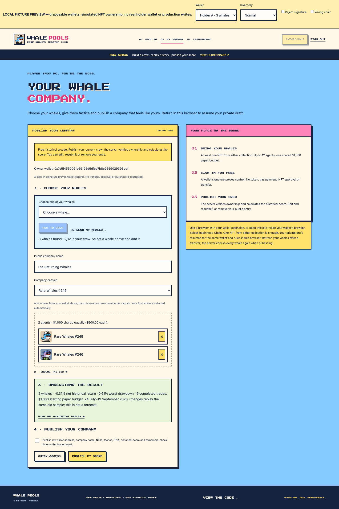
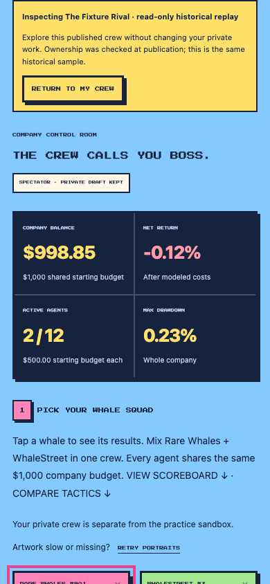

# Holder company journey candidate

Prepared 6 October 2026 for WP-02, WP-03 and WP-06. This candidate is on `codex/holder-company-journey`, based on main `46945f8`. The dependency maintenance draft PR #1 remains separate. Production has not been changed.

## What holders can do

A holder's unpublished whales, tactics, captain, selected whale and unfinished company name resume in the same browser, for the same wallet and exact scoring rules version. An intentionally empty crew is preserved. Sandbox practice has its own storage. Sign-out and wallet changes keep the outgoing private draft and reset the visible wallet state. Consent, signatures, credentials and generated scores are never draft fields. Browser storage is local to the browser profile; it is not an encrypted vault or cross-device synchronisation. Disabled storage produces a visible keep-this-tab-open message.

The journey now shows four steps: choose whales, choose tactics, understand the historical result and publish. My Company summarises return, worst drawdown, completed trades, dates and paper budget before publication. Visitors and signed-in holders can inspect a company's read-only replay and return to their own crew. Inspector, charts and export remain available; rival roster/tactic controls cannot edit the private draft.

## Recovery and integrity

Inventory reads have a 30-second overall limit and 10-second operation limits, cancellation and progress. Recent transfer windows are scanned backwards, with smaller ranges when a provider rejects a range. Inventory is complete only when distinct candidates equal the exact snapshot balance and `ownerOf` confirms each candidate at that same block. Empty balances skip history. Incomplete histories and wrong-network responses fail rather than masquerading as no holdings. Refresh keeps the draft; a successful read removes transferred whales with a visible explanation. Server eligibility and every-whale ownership checks still run independently at publication.

API calls, including JSON-body reads, are bounded to 20 seconds. Wallet prompts are bounded to 90 seconds; passive restored-session reads use five seconds. These bounds release the app; they cannot close an extension's old popup. Wallet revisions, cancellation and request generations ignore stale results. Authorised provider discovery is reattached on a restored session, so account/chain changes after reload sign out the visible session safely.

After an uncertain publish/withdraw response, the app reads the saved entry before inviting a retry. A successful attempt is confirmed by its mutation receipt and new revision, with canonical roster comparison. If the read also fails, publish/withdraw remain gated behind Check my saved entry. If the read succeeds without confirming that attempt, the holder may review/retry. A late request cannot overwrite a newer mutation: the server atomically checks the expected company revision, advances it, and writes under a unique internal commit token. Revision rows survive withdrawal, preventing a late create from restoring a removed entry. Signatures and ownership checks are unchanged.

Frozen scoring, DNA v1, the historical sample, rank definitions and original source/data checksums are unchanged. WWAX remains deferred. No Vector Desk files are part of this candidate.

## Local review

Build with `npm ci` and `npm run build:demo` in `apps/rare-whales`. The branch intentionally retains main's dependency lock; merge/review maintenance PR #1 separately before release.

For the normal local app, use `RW_PORT=48374 RW_BASE_PATH=/whalepools npm run dev`, then open `http://127.0.0.1:48374/whalepools/`. This uses its local SQLite database, not production D1. It reads real chain providers when an actual wallet is used. No eligible-holder signature has been exercised in this sprint.

For the playable fixture review, use `node --experimental-sqlite scripts/serve-fixture.mjs`, then open `http://127.0.0.1:48373/`. Its obvious fixture toolbar provides disposable test wallets, simulated holdings and failure controls. It runs the real authentication/board code against an in-memory database and signs with public disposable fixture keys. It makes no production writes. Do not send assets or real funds to those keys. The fixture provider/server is excluded from the Worker allowlist and public build.

Run `node --experimental-sqlite scripts/check-journey.mjs` for browser regression evidence. It uses installed Playwright and Chromium; `RW_PLAYWRIGHT_MODULE`, `RW_BROWSER_EXECUTABLE` and `RW_EVIDENCE_DIR` may specify their paths/output. It does not add a browser dependency to the application lock. The harness saves JSON and screenshots under ignored `work/journey-check` by default.

## Screenshots

These are fixture states, using simulated holdings and disposable wallets.

## Verification and acceptance

Final results and screenshots are recorded in the planning workspace's `reviews/2026-10-06/holder-journey-evidence.json` and `HOLDER_SPRINT_REVIEW.md`. Fixture signing establishes deterministic browser/API behavior, not compatibility with a real eligible wallet, mobile wallet browser or WalletConnect. Only the injected EIP-1193/EIP-6963 route is implemented.

Before a production release, an eligible holder must use the chosen desktop extension and mobile wallet browser against isolated staging: sign in, publish, edit, reload, inspect a rival, switch accounts/networks, reject a signature, refresh after transfer and withdraw. Verify the resulting public ownership snapshot and exact score. Repeat a failure/retry with the real provider. Save the staging/release receipt and production smoke check before marking WP-06 released.

## Release and rollback

Apply additive migration `0004_arcade_revisions.sql` to a separately verified staging database before testing this Worker. Rehearse production migration separately and back up the database before an authorised release. This sprint did not create or change a remote staging/production database or deploy a Worker. The new frontend and server are a paired release: old open tabs lack version headers and are asked to reload before publication/withdrawal.

The prior production source is main `46945f8`; the dependency candidate is `2342a40` in PR #1. A code rollback can leave the additive revisions table in place; do not drop/restore live database data as part of a code rollback. Private browser drafts remain namespaced and do not change old ranks. Test a rollback in staging and preserve current entries/ownership snapshots.

## Following sprint proposal

Add a stable public company destination, the historical timestamp/rules version and one share card. Prototype a separately versioned fixed-size loaner challenge with declared contrasting historical episodes and an explicit drawdown objective; enumerate choices to assess dominant tactics while retaining Historical Arcade v1. Define minimal first-party activation/error/return measurement without credentials or signatures. Then run a ten-holder pilot with five interviews: proposed gates are eight unaided publications, median creation under three minutes after wallet readiness, and five meaningful return actions within seven days. Record people separately from wallets. Recruitment/publication and the elapsed seven-day observation are owner steps.
